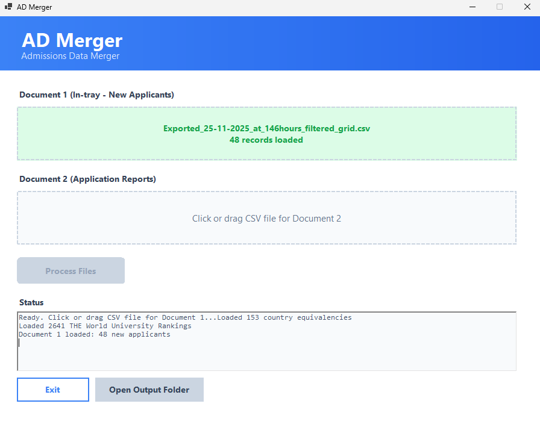
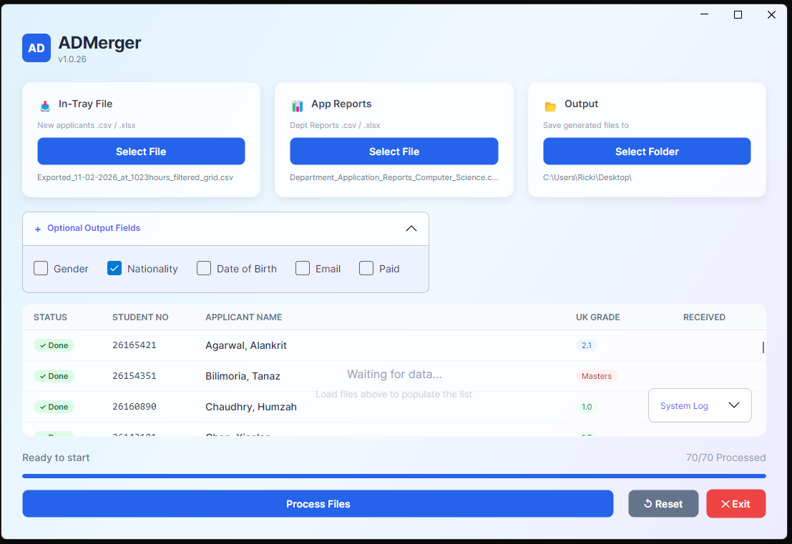

# ADMerger

 

ADMerger is a bespoke, cross-platform standalone desktop application designed to efficiently handle large volumes of data and generate a customised, uniform spreadsheet with fields tailored to your specific needs. 
## Overview

ADMerger accesses two internal JSON files containing student application data and automatically enriches them with:
- THE World University Rankings (2026)
- UK degree classification equivalencies
- Country-specific grade conversions
- University Programme codes and mappings

The application uses intelligent fuzzy matching with Levenshtein distance algorithm to handle institution name variations and abbreviations.

## Features

- **Automated Ranking Lookup**: Matches institution names against T.H.E (Times) World University Rankings using exact and fuzzy matching
- **Configurable Mappings**: Institution name variations, abbreviations, and joint degrees managed via CSV configuration
- **Grade Classification**: Automatic UK grade classification based on country-specific equivalency rules
- **Encoding Normalization**: Handles various text encodings and special characters in international names
- **Modern UI**: Clean Windows Forms interface with drag-and-drop file loading
- **Comprehensive Logging**: Debug logs track all matching decisions for troubleshooting


### Data Confidentiality

Personal data does not persist within this programme. It operates as a "black box": you import your own local student data spreadsheets, the programme processes the data offline by updating its internal state, and then outputs a solution file directly to your desktop.

## Architecture

### Project Structure

```
ADMerger/
├── Program.cs                      # Application entry point with DI setup
├── MainForm.cs                     # Main UI form
├── Models/
│   ├── InTrayRecord.cs            # Document 1 data model
│   ├── ApplicationRecord.cs        # Document 2 data model
│   ├── OutputRecord.cs            # Merged output data model
│   └── DegreeEquivalency.cs       # Country equivalency model
├── Services/ 
│   ├── CsvService.cs              # CSV reading/writing with CsvHelper
│   ├── EquivalencyService.cs      # Country grade equivalencies
│   ├── RankingService.cs          # THE Rankings lookup with caching
│   ├── GradeClassificationService.cs  # UK grade determination
│   └── InstitutionMatchingService.cs  # Fuzzy matching engine
├── UI/Controls/
│   ├── ModernButton.cs            # Styled button component
│   └── ModernFilePanel.cs         # Drag-drop file selector
├── Utilities/
│   ├── DateFormatter.cs           # Date parsing and formatting
│   └── TextNormalizer.cs          # Text cleaning and normalization
├── Configuration/
│   └── ProgrammeMapping.cs        # Programme code mappings
└── data/
    ├── THE Ranking 2026.xlsx      # University rankings data
    ├── ucl_degree_equivalencies_FINAL.csv  # Country equivalencies
    └── institution_mappings.csv   # Institution name mappings
```

### Design Principles

- **SOLID Architecture**: Interface-based design with dependency injection
- **Open-Closed Principle**: Institution mappings externalized to CSV for extension without code modification
- **Separation of Concerns**: Clear separation between UI, business logic, and data access
- **Service-Oriented**: All core functionality encapsulated in injected services

## Fuzzy Matching Algorithm

The application uses a sophisticated Levenshtein distance-based fuzzy matching system:

1. **Normalisation**: Removes diacritics, common words (university, college), and special characters
2. **Word-Level Matching**: Compares significant words between search and candidate names
3. **Exact Priority**: Exact word matches score 100%, fuzzy matches score 50%
4. **Threshold Filtering**: Only matches scoring ≥75% are considered
5. **Special Handling**: NOT_RANKED entries bypass fuzzy matching to prevent false positives

### Matching Examples

```
"University of Warwick" → "University of Warwick" (exact match, 100%)
"LSE" → "London School of Economics and Political Science" (mapping)
"St. Andrews" → "St Andrews" (fuzzy match, 95%)
```

## Configuration

### Institution Mappings (`data/institution_mappings.csv`)

Handles name variations without code changes:

```csv
SourceName,TargetName,MappingType
UCL,University College London,Abbreviation
HKUST,The Hong Kong University of Science and Technology,Abbreviation
Xi'an Jiaotong-Liverpool University,University of Liverpool,JointDegree
Southwestern University of Finance and Economics,NOT_RANKED,NotRanked
```

**Mapping Types:**
- **Abbreviation**: Common abbreviations (MIT, LSE, UCLA, IIT Madras)
- **JointDegree**: Transnational programs map to UK partner ranking
- **NotRanked**: Institutions not in THE Rankings (prevents false matches)
- **AltSpelling**: Regional spelling variations

### Ranking Status Values

- **Numeric**: Single rank (1, 22, 52, 143)
- **Range**: Band ranking (601-800, 1001-1200)
- **Reporter**: Participated in THE process but not ranked
- **NR**: Not found in THE Rankings
***
## Prerequisites ##
#### Before installing, please read... ####

### Required Software:
Whether on Mac or Windows, you need to have the .NET 10 framework installed first. Install the framework on Terminal (Mac) or PowerShell / WSL / Windows CLI.

This application has been tested on macOS Sonoma / Windows 11 or later. It may work on Windows 10 or earlier macOS versions, but this is not guaranteed.

**macOS:**

```bash
# Open Terminal and Install via Homebrew
brew install dotnet@10

# Or download installer from:
https://dotnet.microsoft.com/download/dotnet/10.0

# Verify installation
dotnet --version  # Should show 10.0.x
```
**Windows 11:**
1. Download .NET 10.0 SDK from: https://dotnet.microsoft.com/download/dotnet/10.0
2. Run the installer and follow prompts
3. Verify installation:
```powershell
dotnet --version  # Should show 10.0.x
```
***
## Installation (MacOS Sonoma)
Assuming you already have dotnet@10 installed (see Prerequisites).
```bash
#Open Terminal and clone the repository
git clone https://github.com/TechAngelX/ADMerger.git
cd ADMerger

# Build the app, and run in development mode
dotnet run

# Or better still, build a standalone desktop application
./goDeployMAC.sh       
```
This creates a standalone executable file on your desktop in `~/Desktop/ADMerger_Build/` with: `ADMerger.app` - macOS application bundle with all dependencies.

**Note:** The `goDeployMAC.sh` script is already executable when cloned, but you may get a 'Permission Denied' pop-up - common if you downloaded the ZIP. If you get this error, run `chmod +x goDeployMAC.sh` before executing it with `./goDeployMAC.sh`.

**Mac Build Config:**
- Target: .NET 10.0 macOS
- Runtime: osx-x64
- Self-contained: Yes
- Format: .app bundle
- Embedded resources: All data files
- Output: `~/Desktop/ADMerger_Build/`
***
## Installation (Windows 11)
Assuming you already have dotnet@10 installed (see Prerequisites).

```bash
# Open PowerShell / WSL or other CLI and clone the repository
git clone https://github.com/TechAngelX/ADMerger.git
cd ADMerger

# Build the app, and run in development mode
dotnet run

# Or better still, build a standalone desktop application
.\goDeploy.ps1    
```
**Windows Build Config:**

```
- Target: .NET 10.0 Windows
- Runtime: win-x64
- Self-contained: Yes
- Single file: Yes (with native libraries extracted)
- Embedded resources: All data files (Excel, CSVs)
- Output: `Desktop\ADMerger_Build\`
```
***
## Usage


**How to use:**
1. **Load Document 1**: SELECT In-tray file (latest applicants CSV)
2. **Load Document 2**: Department Application reports CSV (detailed applicant data)
3. **Process Files**: Cross-references by Student No., enriches with rankings and grades
4. **Review Output**: Programme-specific CSV files with all enriched data

### Adding Additional Fields

Optionally select extra fields to include in your output reports. The application provides 24 additional fields from the Department Application Reports that can be added to the standard output.



1. Expand the "Additional Output Fields (Optional)" section
2. Select any fields you want to include from three sections:
   - **Personal Information**: Known as, Email address, Gender, Date of Birth, Nationality
   
   - **Application Details**: Location, State, Academic year, Tag, Qualification end date, etc.
   - **Decision Tracking**: Admissions decisions, dates, deposit status, reply deadlines
3. Selected fields will appear at the end of the Excel output with **light blue column headers** to distinguish them from standard fields
4. Use the Reset button to clear all selections
***
### Input Requirements

**Document 1** must contain:
- Student No.
- Received on date

**Document 2** must contain:
- Applicant ID (matches Student No.)
- Programme, Name, 
- Fee Status, Country of Study
- Qualification, Subject, Institution, Grade
- Equivalency notes

### Output Format

Generates one CSV per programme with columns:
- ReceivedDate, DueDate, StudentNo, Programme
- Forename, Surname,  
- FeeStatus, 
- QualificationName, DegreeSubject, InstitutionName
- **THERanking** (enriched)
- CountryOfStudy, EquivalencyNote, OverallGradeGPA
- **UKGrade** (enriched)
***
## Dependencies

- **CsvHelper** (33.1.0): CSV parsing with class mapping
- **EPPlus** (7.5.2): Excel file reading for THE Rankings

## Logging

Debug logs written to `Desktop\ranking_matches.log`:

```
2025-11-24 20:34:06 - Original: 'University of Oxford' | Normalized: 'University of Oxford' | InDict: True
2025-11-24 20:34:06 - EXACT MATCH: 'University of Oxford' = Rank 1
2025-11-24 20:34:06 - FUZZY MATCH: 'St. Andrews' -> 'St Andrews' = Rank 162
2025-11-24 20:34:06 - NOT RANKED: 'Juniata College' (marked as not in THE Rankings)
```
### Adjusting Fuzzy Match Threshold

Edit `Services/InstitutionMatchingService.cs`:
```csharp
private const int MinimumMatchThreshold = 75; // Increase for stricter matching
```
***
## Known Limitations

- Fuzzy matching may incorrectly match similar Chinese university names (e.g., finance/economics institutions)
- Joint degree identification relies on specific keywords (e.g., "-Liverpool" in institution name)
- THE Rankings "Reporter" status requires manual verification

## License

© Ricki Angel 2026 | TechAngelX
Internal use only.


## Disclaimer

This tool is for personal or educational use only and comes without any warranty.
***
<h2 style="text-align: center;">Support</h2>
<div align="center">
  <span style="font-size: 1.4em; font-weight: 300;">
    For issues or questions, feel free to reach out to me on GitHub.
  </span>
  <br /><br />
  <a href="https://techangelx.com" target="_blank" rel="noopener noreferrer">
    
  </a>
  <br /><br />
  <span style="font-size: 1.4em; font-weight: 300;">
    <b>Built by Ricki Angel</b> • <a href="https://techangelx.com" target="_blank" rel="noopener noreferrer" style="text-decoration: none;">Tech Angel X</a>
  </span>
</div>

